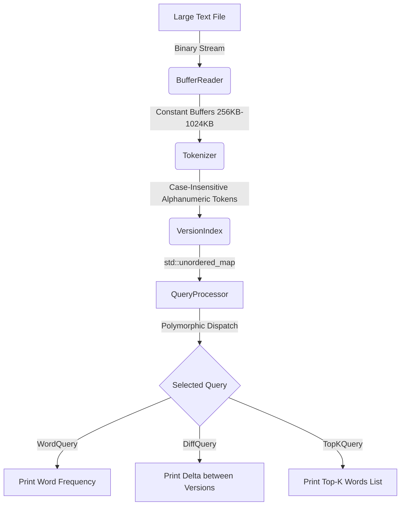

# Memory-Efficient Versioned Text Analyzer & Indexer

Large text files are commonly processed incrementally in real-world systems to avoid excessive
memory usage and performance bottlenecks. To avoid these we have designed.

An optimized, **C++14** tool designed to incrementally parse, tokenize, and index large-scale text files using a fixed-size memory buffer. It supports indexing multiple document versions concurrently, comparative, and frequency queries without loading entire files into memory.

---

## Key Features

* **Incremental Stream Processing**: Limits memory utilization by processing large text files in fixed chunks between **256 KB and 1024 KB**.
* **Robust Tokenization & Boundary Resolution**: Correctly handles word tokens split across buffer boundaries, standardizing characters case-insensitively.
* **Version-Control Analytics**: Manages isolated word-frequency indexes for multiple document versions during a single execution run.
* **Flexible Query Engine**:
  * **Word Query**: Get the frequency of a word in a specific version.
  * **Difference Query**: Compute frequency changes of a word between two distinct versions.
  * **Top-K Query**: Retrieve the $K$ most frequent words in a version, sorted by descending frequency (and alphabetically in case of ties).
* **RAII & Safety**: Ensures resource integrity using Modern C++ smart pointers (`std::unique_ptr`), RAII file handling, and custom error boundaries.
* **Cross-Platform Compilation**: Supports build tooling for both Windows and Unix environments out of the box.

---

## Architecture Overview

The system follows a pipeline architecture, reading characters from a text stream, formatting them into alphanumeric tokens, mapping them to frequency tables, and executing user queries:



---

## Class Breakdown

### 1. `BufferReader`
Manages the incremental file reading logic.
* **Responsibility**: Maintains a binary file stream (`std::ifstream`) and loads it into a fixed-size `std::vector<char>` buffer.
* **Key Mechanisms**:
  * **Buffer Limits**: Validates that the buffer size is within the allowed limits ($256 \text{ KB} \le N \le 1024 \text{ KB}$).
  * **EOF Handling**: Returns character code points as `int` to cleanly differentiate between standard bytes (`0-255` via cast from `unsigned char`) and `EOF` (`-1`).
  * **Methods**:
    * `BufferReader(const std::string& filename, size_t kbSize)`: Parameterized constructor validating constraints and opening the file.
    * `int getNextChar()`: Retrieves the next character. Automatically invokes `loadNextChunk()` when the current buffer window is exhausted.
    * `bool hasNext()`: Evaluates if characters are remaining in the file or memory buffer.

### 2. `Tokenizer`
Parses the character stream into discrete words.
* **Responsibility**: Standardizes inputs and splits character streams into tokens.
* **Key Mechanisms**:
  * **Word Definition**: A word is defined as a contiguous sequence of alphanumeric characters (`std::isalnum`).
  * **Case Insensitivity**: Standardizes all characters to lowercase using `std::tolower`.
  * **Boundary Token Handling**: If a word is split across a buffer boundary, the tokenizer seamlessly fetches the remaining parts via `BufferReader` before returning the token, preventing word fragmentation.
  * **Methods**:
    * `bool getNextToken(std::string& token)`: Populates the string with the next valid word. Returns `false` when the end of the stream is reached.

### 3. `VersionIndex`
Encapsulates index data for a specific document version.
* **Responsibility**: Records the mapping of unique words to their frequency.
* **Key Mechanisms**:
  * Uses `std::unordered_map<std::string, int>` for $O(1)$ average-time word counts and updates.
  * **Sorted Top-K Utility**: Includes a helper template function `getSortedTopK` that copies the hash map elements to a `std::vector`, sorts them in descending order of frequency (alphabetical order for ties), and crops the vector to size $K$.
  * **Methods**:
    * `void addWord(const std::string& word)`: Increments count of a word.
    * `int getCount(const std::string& word)`: Gets the frequency of a word.
    * `const std::unordered_map<std::string, int>& getCounts()`: Returns the raw word mapping.

### 4. `QueryProcessor` (Base Class)
Abstract base class defining the execution interface for analytical queries.
* **Key Mechanisms**:
  * Employs a virtual destructor to prevent memory leaks during polymorphic deletion.
  * Implements `addVersion(const VersionIndex& v)` to store the required versions.
  * Declares a pure virtual function `virtual void execute() const = 0` which child classes implement.
* **Specialized Queries**:
  * `WordQuery`: Resolves single-word frequency queries for a single document.
  * `DiffQuery`: Compares word counts between two versioned indices (`versions[1] - versions[0]`).
  * `TopKQuery`: Lists the top $K$ most frequent words in a document.

### 5. `AnalyzerException`
Inherits from `std::exception` to serve as a custom exception type for project-specific constraints (e.g. invalid buffer sizes, missing arguments, or file access issues).

---

## Compilation & Build Instructions

### Prerequisites
* A C++ compiler supporting **C++14** (such as `g++`).
* GNU Make or MinGW Make.

### Compilation
Open a terminal in the project directory and run:

**On Linux / macOS:**
```bash
make
```

**On Windows (using MinGW):**
```bash
mingw32-make
```

This will create an object directory (`build/`) and compile the source code into a binary executable named `analyzer` (or `analyzer.exe` on Windows).

### Cleaning Build Artifacts
To delete binary and intermediate object files:

**On Linux / macOS:**
```bash
make clean
```

**On Windows (using MinGW):**
```bash
mingw32-make clean
```

---

## CLI Usage & Options

The application runs via the command-line interface. 

### CLI Options
| Option | Argument | Description |
|---|---|---|
| `-h`, `--help` | None | Displays help information and exits. |
| `--file`, `--file1` | `<PATH>` | Specify the path of the main input file. |
| `--file2` | `<PATH>` | Specify the path of the second input file (for `diff` query). |
| `--version`, `--version1` | `<NAME>` | Define the version name for the first file. |
| `--version2` | `<NAME>` | Define the version name for the second file. |
| `--buffer` | `<KB>` | Buffer size in Kilobytes (integer between `256` and `1024`, defaults to `256`). |
| `--query` | `word` \| `diff` \| `top` | Set the query type to execute. |
| `--word` | `<WORD>` | Target word for `word` or `diff` queries. |
| `--top` | `<K>` | Number of top results to retrieve (for `top` query). |

---

## Usage Examples

### 1. Word Frequency Query
Retrieve the frequency of the word `"error"` in `system_v1.log`:
```bash
./analyzer --file system_v1.log --version V1 --query word --word error
```
**Example Output:**
```text
Version: V1
Query result: 48
Allocated buffer size: 256 KB
Total execution time: 0.0125 seconds
```

### 2. Version Difference Query
Compute the difference in frequency for the word `"debug"` between version `V1` (`system_v1.log`) and version `V2` (`system_v2.log`):
```bash
./analyzer --file1 system_v1.log --version1 V1 --file2 system_v2.log --version2 V2 --query diff --word debug
```
**Example Output:**
```text
Version: V1, V2
Query result: Diff (V2 - V1) = -15
Allocated buffer size: 256 KB
Total execution time: 0.0241 seconds
```

### 3. Top-K Frequent Words Query
Find the top 5 most frequent words in `document.txt`:
```bash
./analyzer --file document.txt --version Draft1 --query top --top 5
```
**Example Output:**
```text
Version: Draft1
Query result:
the -> 142
and -> 98
to -> 87
of -> 75
a -> 64
Allocated buffer size: 256 KB
Total execution time: 0.0089 seconds
```

---

## Technical Highlights & Safety Design

* **Constant Memory Footprint**: The application allocates the specified buffer size once at startup and uses this single array for all file parsing. This ensures stable memory consumption regardless of whether you process a $1 \text{ MB}$ or $10 \text{ GB}$ text file.
* **C++ Memory Best Practices**: Memory management is handled via standard containers (`std::vector`, `std::unordered_map`) and smart pointers (`std::unique_ptr`). Raw `new`/`delete` pointers are avoided, rendering the application free of memory leaks.
* **Custom Stream Caching**: The custom binary stream caching inside `BufferReader` reduces system context switches and disk head thrashing, maximizing execution speed.